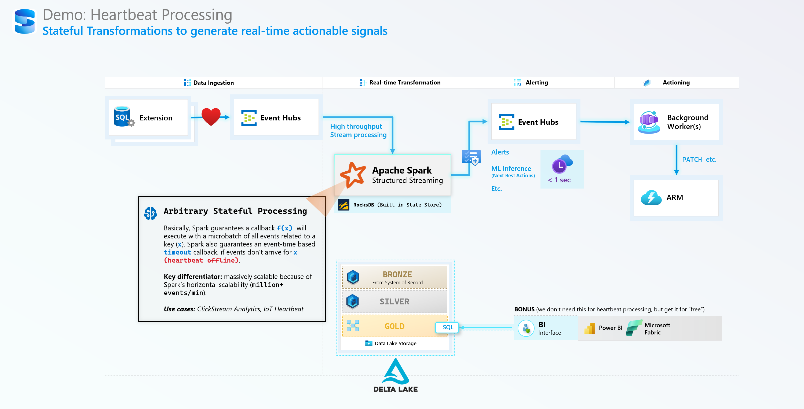

# heartbeat-dotnet

Simple Heartbeat generator and consumer, with a Spark Processor:

* HeartbeatDemo > Producer - a mock SQL Machine
* HeartbeatDemo > Consumer - a mock Event Subscriber
* HeartbeatDemo > Processor - Spark Streaming with `flatMapGroupWithState`

